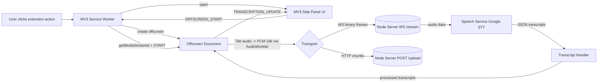

# Live Audio to Text Transcriber (Chrome MV3)
A Chrome extension (Manifest V3) with a side panel UI that captures tab audio in real time using an offscreen document and streams 16kHz PCM audio to a Node.js backend over WebSocket or HTTP. The server performs speech-to-text and streams transcripts back live to the extension.


[](https://www.youtube.com/watch?v=npiVD7-XejM&feature=youtu.be)


### Tech Stack

- **Extension**: React 19 + TypeScript, Vite, MV3 side panel, offscreen audio worklet
- **Server**: Node.js + Express + `ws`, Google Cloud Speech-to-Text client
- **Linting**: ESLint (TS)

Note: The backend image is currently deployed on GCP Cloud Run.


## Development

### Prerequisites

- Node.js 18+
- npm or yarn
- Chrome (latest)


## High-level Architecture



Note: The backend image is currently deployed on GCP Cloud Run.


## Quick Use (Pre-built Extension)

Use this method to quickly test the extension without any local setup. This uses the included pre-built dist/ folder and connects to a public backend server by default.

1) Unzip the File: Find the `audio-to-speech-extension.zip` file in the project root and extract it. You will get a folder named dist inside audio-to-speech-extension/.

2) Open Chrome Extensions: Open your Chrome browser and navigate to `chrome://extensions/`.

3) Enable Developer Mode: In the top-right corner, toggle on "Developer mode".

4) Load the Extension: Click the "Load unpacked" button and select the dist folder you extracted in the first step.

5) The extension is now installed and ready to use!


## Local Development Setup (Build from Source)

Follow these steps if you want to run your own local server, modify the code, and build the extension from scratch.

### 1) Clone the repo
```bash
git clone <your-repo-url>
cd audio-transcription-extension
```

### 2) Install dependencies (extension and server)
```bash
# Extension
cd extension
npm install

# Server
cd ../server
npm install
```

### 3) Configure backend credentials (.env + Google Service Account)

The backend uses Google Cloud Speech-to-Text. You need a service account with the right role and a credential file.

Step-by-step (beginner-friendly):
1. Create a Google Cloud project (or use an existing one)
2. Enable the Speech-to-Text API
3. Create a Service Account with the role: "Cloud Speech Client"
4. Create a JSON key for that service account and download it
5. Place the JSON key at: `server/.config/google-credentials.json`
6. Copy `server/.env.example` to `server/.env` and set:
   ```bash
   PORT=3001
   GOOGLE_APPLICATION_CREDENTIALS=/server/.config/google-credentials.json
   ```
   - For local runs without Docker, you can set an absolute path to your JSON key
   - For Cloud Run, prefer assigning a service account to the service (no key file)

### 4) Start the server
```bash
cd server
npm run start
# Server: http://localhost:3001, WS: ws://localhost:3001/stream
```

### 5) Build the extension
```bash
cd ../extension
npm run build
```

### 6) Load the extension in Chrome
- Open `chrome://extensions/`
- Toggle on Developer mode
- Click "Load unpacked" and select `extension/dist`


## Configuration

### Extension env (Vite)
Set these in an `.env` file inside `extension/` if you want to customize endpoints:
```bash
VITE_BACKEND_WS_URL=ws://localhost:3001/stream
VITE_BACKEND_HTTP_URL=http://localhost:3001/upload
```

Defaults are used if not provided.

### Server env
```bash
PORT=3001
# If using Google Cloud Speech-to-Text:
# GOOGLE_APPLICATION_CREDENTIALS=/absolute/path/to/your-service-account.json
```


### Project Structure

```
audio-transcription-extension/
├── extension/
│  ├── public/
│  │  └── pcm16k-processor.js      # AudioWorklet processor (16kHz mono PCM)
│  ├── src/
│  │  ├── manifest.json            # MV3 manifest
│  │  ├── service-worker.ts        # Background, tab capture, offscreen control
│  │  ├── offscreen.ts             # Offscreen doc, audio capture + transport
│  │  ├── sidepanel.tsx            # React UI
│  │  ├── components/              # UI sections: Recording/Notification/etc
│  │  ├── utils/                   # api, audio, time helpers
│  │  └── styles/                  # Side panel styles
│  └── dist/                       # Build output (after npm run build)
└── server/
   ├── server.ts                   # Express + WS bootstrap
   ├── websocket-handler.ts        # WS endpoint and streaming bridge
   ├── speech-service.ts           # Google STT streaming service
   ├── routes.ts                   # /health and /upload endpoints
   └── utils/logger.ts             # pino logger
```


## ToDo List

- [ ] Capture microphone audio and process in a separate channel
- [ ] Create adapters in backend for OpenAI Whisper and other STT providers
- [ ] Switch from WS to POST automatically if connection is weak/offline
- [ ] Inactive tab audio capture
- [ ] Implement a message queue in backend for retry capability
- [ ] Use IndexedDB instead of `chrome.storage.local` to support long streams


### Extension Scripts (run inside `extension/`)
```bash
npm run build        # Build extension to dist/
```

### Server Scripts (run inside `server/`)
```bash
npm run build        # Build TypeScript
npm run start        # Start server (ts-node or compiled depending on package.json)
```


## Permissions (MV3)

From `extension/src/manifest.json`:

- `activeTab`
- `storage`
- `sidePanel`
- `tabCapture`
- `offscreen`
- `host_permissions`: `<all_urls>`


## Privacy & Security

- Audio is captured from the active tab only when you press record
- Audio frames are sent to your local server for transcription
- No analytics are collected; state is stored locally via `chrome.storage.local`
- Review and comply with Chrome Web Store privacy policies if distributing


## License

This project is licensed under the MIT License - see the [LICENSE](LICENSE) file for details.

## Support

If you encounter issues or have questions:

1. Check the [Issues](../../issues) page for existing solutions
2. Create a new issue with detailed information about the problem
3. Include Chrome version, extension version, and steps to reproduce

## Contributing

1. Fork the repository
2. Create a feature branch: `git checkout -b feature/new-feature`
3. Commit changes: `git commit -am 'Add new feature'`
4. Push to branch: `git push origin feature/new-feature`
5. Submit a pull request

## Changelog

### 0.0.1
- Initial side panel + offscreen capture
- WebSocket streaming + HTTP fallback
- Server health and upload endpoints
