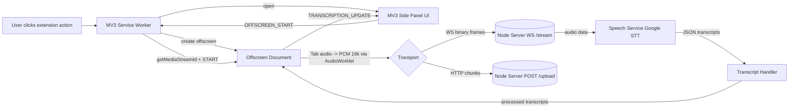

# Live Audio to Text Transcriber (Chrome MV3)

A Chrome extension (Manifest V3) with a side panel UI that captures tab audio in real time using an offscreen document and streams 16kHz PCM audio to a local Node.js server over WebSocket or HTTP. The server performs speech-to-text and streams transcripts back live to the extension.

## Features

- **Real-time transcription**: Live partial and final transcripts streamed to the side panel
- **MV3 side panel UI**: Modern React 19 UI available on any tab via the extension action
- **Tab audio capture (no content script required)**: Uses `chrome.tabCapture` and an MV3 offscreen document
- **Robust transport**: Primary WS streaming with automatic fallback to HTTP chunk upload
- **Session management**: Multiple sessions with titles (per-tab), timestamps, and auto-scrolling
- **Copy & export**: One-click copy, TXT and JSON export of the full transcript
- **Resilient handling**: Connection status indicator, auto-reconnect prompts, and safe stop/clear

## Quick Setup

### 1) Clone the repo
```bash
git clone <your-repo-url>
cd audio-transcription-extension
```

### 2) Install dependencies (extension and server)
```bash
# Extension
cd extension
npm install

# Server
cd ../server
npm install
```

### 3) Configure server environment (optional)
Create `server/.env` if you want to change the port (defaults to 3001):
```bash
PORT=3001
```

If using Google Cloud Speech-to-Text, ensure your environment has credentials configured (e.g., `GOOGLE_APPLICATION_CREDENTIALS`).

### 4) Start the server
```bash
cd server
npm run start
# Server: http://localhost:3001, WS: ws://localhost:3001/stream
```

### 5) Build the extension
```bash
cd ../extension
npm run build
```

### 6) Load the extension in Chrome
- Open `chrome://extensions/`
- Toggle on Developer mode
- Click "Load unpacked" and select `extension/dist`

## Usage

1) Click the extension icon to open the side panel for the active tab.
2) Ensure the backend server is running; the side panel shows online/offline status.
3) Press the record button. The extension will:
   - Request a tab-capture stream ID via `chrome.tabCapture.getMediaStreamId`
   - Spin up an offscreen document to process audio frames at 16 kHz
   - Stream PCM frames over WS (or batch via HTTP fallback)
4) Watch live transcripts update. Toggle recording to stop; export or copy results.

## Configuration

### Extension env (Vite)
Set these in an `.env` file inside `extension/` if you want to customize endpoints:
```bash
VITE_BACKEND_WS_URL=ws://localhost:3001/stream
VITE_BACKEND_HTTP_URL=http://localhost:3001/upload
```

Defaults are used if not provided.

### Server env
```bash
PORT=3001
# If using Google Cloud Speech-to-Text:
# GOOGLE_APPLICATION_CREDENTIALS=/absolute/path/to/your-service-account.json
```

## Development

### Prerequisites

- Node.js 18+
- npm or yarn
- Chrome (latest)

### Tech Stack

- **Extension**: React 19 + TypeScript, Vite, MV3 side panel, offscreen audio worklet
- **Server**: Node.js + Express + `ws`, Google Cloud Speech-to-Text client
- **Linting**: ESLint (TS)

### Extension Scripts (run inside `extension/`)
```bash
npm run dev          # Vite dev server (for building; MV3 loads built files)
npm run build        # Type-check and build extension to dist/
npm run build:watch  # Watch build
npm run lint         # ESLint
npm run preview      # Preview production build
```

### Server Scripts (run inside `server/`)
```bash
npm run start        # Start TS server with ts-node
npm run build        # Type-check and build
npm run start:prod   # Run compiled server (dist)
```

### Project Structure

```
audio-transcription-extension/
├── extension/
│  ├── public/
│  │  └── pcm16k-processor.js      # AudioWorklet processor (16kHz mono PCM)
│  ├── src/
│  │  ├── manifest.json            # MV3 manifest
│  │  ├── service-worker.ts        # Background, tab capture, offscreen control
│  │  ├── offscreen.ts             # Offscreen doc, audio capture + transport
│  │  ├── sidepanel.tsx            # React UI
│  │  ├── components/              # UI sections: Recording/Notification/etc
│  │  ├── utils/                   # api, audio, time helpers
│  │  └── styles/                  # Side panel styles
│  └── dist/                       # Build output (after npm run build)
└── server/
   ├── server.ts                   # Express + WS bootstrap
   ├── websocket-handler.ts        # WS endpoint and streaming bridge
   ├── speech-service.ts           # Google STT streaming service
   ├── routes.ts                   # /health and /upload endpoints
   └── utils/logger.ts             # pino logger
```

## Permissions (MV3)

From `extension/src/manifest.json`:

- `activeTab`
- `storage`
- `sidePanel`
- `tabCapture`
- `offscreen`
- `host_permissions`: `<all_urls>`

## Privacy & Security

- Audio is captured from the active tab only when you press record
- Audio frames are sent to your local server for transcription
- No analytics are collected; state is stored locally via `chrome.storage.local`
- Review and comply with Chrome Web Store privacy policies if distributing

## High-level Architecture



## License

This project is licensed under the MIT License - see the [LICENSE](LICENSE) file for details.

## Support

If you encounter issues or have questions:

1. Check the [Issues](../../issues) page for existing solutions
2. Create a new issue with detailed information about the problem
3. Include Chrome version, extension version, and steps to reproduce

## Contributing

1. Fork the repository
2. Create a feature branch: `git checkout -b feature/new-feature`
3. Commit changes: `git commit -am 'Add new feature'`
4. Push to branch: `git push origin feature/new-feature`
5. Submit a pull request

## Changelog

### 0.0.1
- Initial side panel + offscreen capture
- WebSocket streaming + HTTP fallback
- Server health and upload endpoints
